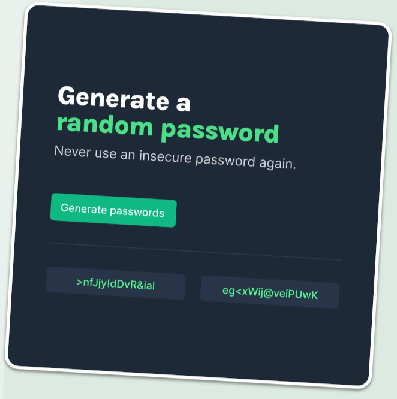

# Password-generator

<h2>Languages and Tools</h2>

-HTML5
-CSS3
-JavaScript
-Virtual Studio Code
-Git

<h2>What I Learnt</h2>

-How to add Random values and put them together in order to form a "string";

<h2>It started as :</h2>

<h2>Current project:</h2>

[Password generator Link](https://egomessss.github.io/Password-generator/)

<h2>What I added to improve functionality:</h2>

- A input that allows the user to choose the password length, in this case 5 trought 30.
- A button to reset the password generator textbox.

<h2>My biggests difficulties and how I overcame them</h2>
- The biggest issue I had with this project was to get the functionaly of adding a copy button, which isn't even commited yet because I am still working on it, so that the user can copy the password that is generated.
